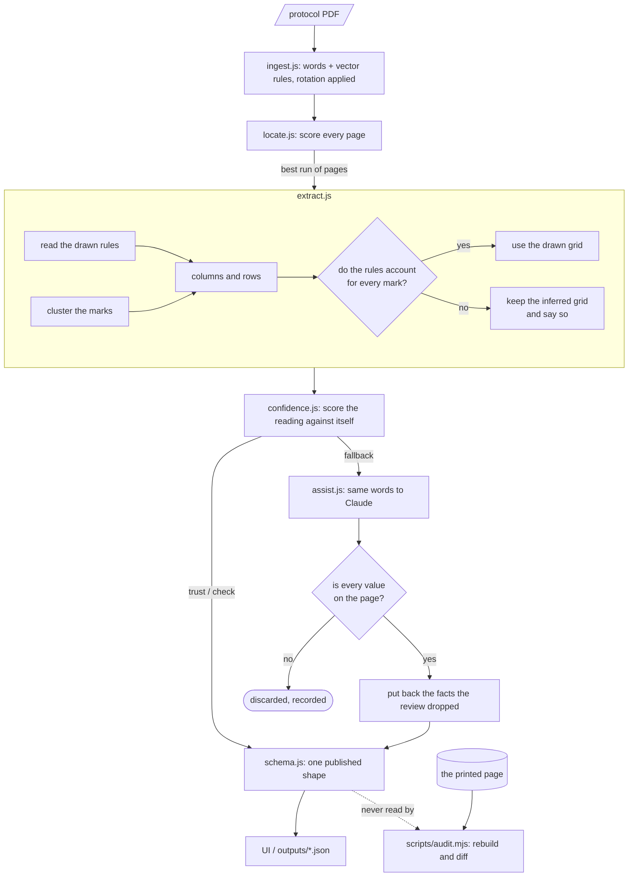

<div align="center">

# SoA Extractor

*Find the Schedule of Activities in a protocol nobody told you about, and rebuild it verbatim.*

[Setup](#setup) · [How It Works](#how-it-works) · [Architecture](#architecture) · [Schema](#output-schema) · [Tools](#tools-evaluated) · [Verification](#manual-verification-per-protocol) · [Limits](#where-it-breaks)

Give it an 80 to 250 page clinical trial protocol. It finds the Schedule of Activities, whatever the sponsor called it and wherever it sits, and rebuilds the grid **verbatim**, with footnotes bound to the cells they modify.

It reads the table **from the lines the document draws**. The columns are the vertical rules, the rows are the horizontal ones: free, offline, about a second for a 97 page protocol. It then **scores that reading against itself**, and only where its own checks say the result cannot be trusted does it ask a model for a second opinion. Every value that comes back is **validated against the words actually on the page**, so a model can miss a cell but cannot invent one.

**Live:** [soa.rishabai.me](https://soa.rishabai.me)

</div>

---

## Setup

```bash
npm install
npm run serve            # UI on http://localhost:3100, drop in any protocol PDF
npm run serve:geometry   # the same, with the model review forced off
npm run serve:review     # the same, with it forced on
npm run extract -- path/to/protocol.pdf [more.pdf ...]   # writes outputs/<name>.json
```

Node 22.13 or newer, which is what pdfjs-dist needs. CI proves it: a Node 20 run fails on `Promise.withResolvers`.

**The second opinion is optional.** With no key the tool runs geometry only and says where it is unsure rather than guessing. To enable it, put a key in `.env` (gitignored):

```
ANTHROPIC_API_KEY=sk-ant-...
SOA_ALLOW_REVIEW=1
```

The review runs only on a table the checks distrust, so a well read protocol comes out identical either way and costs nothing. Of the eight documents tested here, seven never reach it. `outputs/` holds the committed result for all five assignment protocols, produced by the rule-based path with no model involved.

---

## How It Works

### The locator

No page numbers, no section lookup. Every page is scored on evidence that a schedule is printed on it, and the run of pages with the best score wins.

| Signal | Why |
|---|---|
| Study period words (`screening`, `treatment`, `follow-up`) | A schedule names its phases; prose about them rarely does so in a header row. |
| Cell-like marks stacking at the same x | A column is marks in a vertical line. Prose has none. |
| Grid-like rows | Several lines that each carry a label and several marks. |
| Footnote definition lines below | A schedule carries its footnotes under it. |
| A title that names it | Weighted, never required. The heading is not always "Schedule of Activities". |

Adjacent pages that score are joined into one table, so a schedule running across four pages is one table rather than four fragments. A page announcing a *different* table starts a new one, which is how protocol5's blood-collection appendix stays separate from its main schedule.

### The extractor

The first design inferred the table from where the marks were: cluster the X's into columns, cluster the lines into rows. That fails in exactly the ways a schedule is hardest to read. A visit with one mark never becomes a column; a wrapped assessment name merges with its neighbour or splits in half; a row of shaded cells has no marks at all and disappears.

These are **ruled tables**, and the lines are in the PDF as vector paths. Reading them turns inference into measurement. On our own held-out mock that took the schedule from 11 columns to the 18 it actually has.

| Step | What it does |
|---|---|
| **Rules** | Vector paths that are long one way and thin the other are the grid. Collinear segments are joined, because a boundary drawn in two pieces is still one boundary, and because column rules stop where cells are merged. |
| **Columns** | The vertical rules, minus the activity column. Where a page draws none, fall back to clustering marks. |
| **Rows** | The horizontal rules. A band holding more than one named row is subdivided, because some sponsors rule only their sections. |
| **Guarded adoption** | Both readings are built and the ruled one is used **only if it accounts for every mark the inferred one found**. A better source of structure that loses a mark has made the output worse. |
| **Header** | Lines grouped by the ruled cell they sit in, so "Visit 0" over "Stabilization" is one heading. A banding heading spans exactly the columns its own cell encloses; where the header is unruled, it spans the run of columns it is centred over. |
| **Footnotes** | A marker must be one the grid prints, or take the next place in the block's own sequence. A continuation line must not be set in larger type. |

**Faithful, not clever.** `3X/week`, `(X)`, `Xa`, `1X`, `12/ Term` are stored as printed. A shaded cell with no character does not become an X. A ruled column with no heading and no marks is recorded rather than reported as a visit. Anything the tool cannot settle goes into `ambiguities` rather than being resolved quietly.

---

## Architecture



The dotted line is the point. The audit rebuilds the table from the page's own ruled intersections, with none of the extractor's row assembly, header roles or footnote logic, and diffs the two. It has disagreed with the extractor repeatedly and has usually been right.

---

## Output Schema

One shape, whichever path read the table. The whole schema is in `src/schema.js`.

```jsonc
{
  "tables": [{
    "title": "Table 1. Overview of Study Assessments",
    "pages": [25, 26, 27],
    "columns": [{
      "id": "c3",
      "label": "Treatment Week 4",     // what a reader calls this visit
      "path": ["Treatment"],           // the grouping above it, outermost first
      "visitNumber": null,
      "studyDay": null,
      "studyWeek": "4",                // the timepoint facts, kept apart
      "window": "+/- 3 days",
      "markers": ["b"],                // footnotes on the heading itself
      "divider": true                  // only when true: a rule between phases,
                                       // not a visit, so a count can exclude it
    }],
    "rows": [{
      "id": "r7",
      "label": "Vital signs",
      "kind": "assessment",            // or "category": structure, not an activity
      "category": "Safety",            // the category row above it
      "markers": [],
      "cells": [{ "col": "c3", "value": "X", "markers": ["b"] }]   // markers only when present
    }],
    "footnotes": [{
      "marker": "b", "printed": "Xb",  // what matches cells vs what the page shows
      "text": "…full text, joined across the page break…",
      "pages": [25, 26], "continued": true,
      "kind": "footnote",              // or "note": a legend like "X = performed"
      "appliesTo": [{ "target": "cell", "row": "r7", "col": "c3" }]
    }],
    "ambiguities": ["…what it could not settle, in words…"],
    "provenance": { "readBy": "geometry", "confidence": 0.85, "verdict": "check", "findings": [] }
  }]
}
```

**Why this shape.**

- **Columns and rows are ids, cells reference them.** A cell is a fact about one row and one column, so the grid survives a column being added or a row being split without every cell needing rewriting.
- **The hierarchy is `path` on a column and `category` on a row**, rather than nesting. Flattening loses the structure the brief asks for; nesting makes "give me every cell for Week 4" a tree walk. An ordered path keeps both.
- **Timepoint facts are separate fields**, because a visit number, a study day, a study week and a window are four different things stacked in four header rows, and the schedule is unreadable if they are joined into one string.
- **`markers` sit beside `value`, never inside it.** A cell printed as `3X/week` with a superscript `d` is a `3X/week` cell that footnote d qualifies. Storing `"3X/weekd"` is neither what the page shows nor something a footnote can link to.
- **`appliesTo` runs from the footnote to what it modifies**, and carries the target kind, so a footnote on a column heading is distinguishable from one on a single cell. This is the linkage the brief grades.
- **`ambiguities` and `provenance` are part of the output, not logs.** A consumer needs to know that a table scored `fallback`, or that a column was ruled but empty, at the same moment it reads the grid.

---

## Tools Evaluated

**pdfjs-dist, chosen.** The only reader benchmarked that exposes a per-item transform matrix, which is what makes rotated pages recoverable: composing it with a rotated viewport gives upright coordinates for the landscape continuation pages where protocol9's four pages live. It also keeps a superscript attached to its mark, so `Xa` arrives as one string, which is what allows footnote linkage without character-level font analysis.

**pdftotext and plain text layers, rejected for extraction.** Reading order on a schedule is meaningless: the marks arrive as a stream with no column identity. Used here only for the locator's scoring, where reading order does not matter.

**Three models benchmarked on the same task**, all reading positioned text, judged against protocol9, whose correct answer of 11 columns was established by hand from the printed header:

| Model | Columns | Rows | Cost | Verdict |
|---|---|---|---|---|
| `claude-opus-5` (effort high) | 11 ✅ | 39 | $0.69 | correct, and the most expensive thing here |
| **`claude-sonnet-5` (effort medium)** | **11 ✅** | **40** | **$0.125** | **chosen**, same answer, 5× cheaper |
| `openai/gpt-oss-120b` (Groq, free) | 11 ✅ | **21 ❌** | free | rejected: dropped 18 of about 39 rows |

All three got the column axis right, which is the part geometry fails at. They differ on recall, and a dropped assessment is the failure the brief penalises most, so the free option was rejected on quality rather than on principle. Sonnet at medium effort matched Opus at high effort here and cost a fifth as much: the work is *grouping words already read*, not reasoning, and thinking tokens are where the money goes.

That comparison also produced a fix. The Groq run revealed that an *empty* review was rejected but a *shrunken* one was accepted. A review returning fewer named rows than were already found is now discarded and the rule-based read stands.

**Groq remains supported**: set `GROQ_API_KEY` and `SOA_PROVIDER=groq`. It is genuinely fast, 18s against 90s, and free. Note the brief's rule about not uploading protocols where they would be retained. Anthropic's API does not train on API inputs; check a free tier's terms before sending protocol content to it.

**Vision on page images, not used.** It is the stronger option for *scanned* protocols and none of the five are scanned. Against it: a native rasteriser to install, higher cost per page, and, deciding the matter, it makes the model *transcribe*, which is where a model is quietly wrong. Sending words already read keeps the verbatim guarantee and lets every value be checked mechanically. If scans mattered, this is the first thing to add.

**Camelot and Tabula, not evaluated, and they deserve a straight answer.** Their lattice mode does what this tool ended up doing: read the ruled lines. That approach is right, and arriving at it the slow way is the most useful thing this exercise taught me. What a general table library does not carry is the part that makes a *schedule* readable: a footnote bound to the cell its marker sits on, a value written across three columns, a heading that bands a group of visits, a word set vertically between two phases, and a guard that refuses a better structural reading when it would lose a mark. Those are the graded requirements and they would have had to be written on top of Camelot anyway. Given the week again I would still read the rules directly, but I would look at lattice mode on day one rather than day six.

**AWS Textract and Azure Document Intelligence, not evaluated.** They need paid accounts, and their table models flatten multi-row grouped headers, which is a graded requirement here. That is a judgement call, not a measurement.

---

## Manual Verification, Per Protocol

Method: render the source pages, put them beside the extracted grid, compare cell by cell. Every count below was read off the printed page. The numbers are from `outputs/`, which is the rule-based path with **no model involved**.

| Protocol | Result | Verdict |
|---|---|---|
| protocol1 (Lilly LZZT, pp. 53–54) | 14 columns · 28 rows · 5 footnotes | exact |
| protocol5 (atomoxetine, pp. 50–53, rotated) | two tables: 11 × 31 · 9 footnotes, and 15 × 8 · 1 footnote | both exact |
| protocol9 (lofexidine, pp. 26–29, rotated) | 11 columns · 32 rows · 3 footnotes | columns exact; 2 rows and 1 value short |
| protocol12 (modafinil, pp. 48–50) | 9 columns · 39 rows · 13 footnotes | exact |
| protocol15 (cabergoline, pp. 25–27) | 9 columns · 33 rows · 7 footnotes | exact |

**protocol1.** The printed table has a **blank spacer column** where visit 6 would be. No visit is invented for it and the gap is recorded as an ambiguity. Page 54's `Hemoglobin A1c` stitches onto page 53's `Hemoglobin A1C` rather than becoming a second row. `Xa`, `Xb` and the `P` legend link to the right cells. It also prints `Abbreviations: CT = computed tomography; ECG = electrocardiogram` right where the footnotes are — no marker, tied to no cell, but it still qualifies what the table's text means, so it is read as a table-wide note rather than dropped for having nothing to link to. The note is generalised on shape (a label word like Abbreviations, Definitions or Legend, followed by `TOKEN = definition` pairs), not on these specific abbreviations, so it holds for any protocol that prints a legend this way. Page 54 reprints it with two more terms added (`ET`, `RT`); the fuller version is kept rather than the first one seen.

**protocol5.** Appendix I is exact: 11 columns (Up to −35, −15* to −9, −6, −2, −1, 7, 8, 12, 13, 17, 31) and 31 rows. It also satisfies a check the document implies: PK samples for cocaine, 5 mL × (15+15+15) = **225 mL**, exactly the printed Total Volume, with a grand total of 390 mL.
It carries a **second schedule** too, `APPENDIX II: Schedule of Blood Collections`, printed on page 51 under the tail of the first. Both are returned, as `t1` and `t2`; the audit rebuilds the appendix from its own drawn rules and finds 11 printed rows with no missing row, no cell mismatch, and all 15 column headings accounted for — a two-line banding header (`Type` over `a`, `Number of Samples per Day` over the twelve day columns, `Total` over `Volume`) resolved to the right name for each. Its own legend, `a S = serum, P = plasma; b D = day`, is read as a footnote rather than an extra row with no name, and the sponsor's running footer beneath it is recognised as page furniture rather than one more row of data.

**protocol9.** The hardest of the five: four rotated pages. Inferring the grid from marks produced **30 columns for an 11 day study**; reading the drawn rules produces **11**, which the printed header confirms. Shaded-only rows carry **no cells**, because the document marks them with grey and no character, and neither path invents an X. Spanning cells printed as `Prior to Day 4` across days 1–3 survive verbatim, recorded against each day they cover. CRF numbers `(01)`–`(14)` stay in the row labels.
**What is wrong:** `Emesis Tracking (14)` and `Drop Out Day (…)` are not returned, and `Urine Toxicology (28)`'s written-out value `Admission, Monday, Wednesday, Friday, Discharge and As Needed` is dropped. All three sit below the last marked row on a rotated page, beside a legend line, and the rules exclude them. The review recovers them.

**protocol12.** The ninth column is `RANDOMIZATION`, printed **turned on its side** between the screening and treatment phases: thirteen single-letter items at one x. Read literally that is thirteen cells saying "R", "A", "N", "D"; read as a word it is a divider, flagged `divider: true` so anything counting visits can exclude it. What separates it from a genuine column of one-letter values is variety, since protocol1 writes "P" over and over and a word does not repeat itself that way. Markers link per cell: `Alcohol breathalyzer` reads `X[a] X[b] X[b] X[b] X[b] X[c]`, matching the printed superscripts. All 14 footnotes are captured including the block spilling onto two following pages.

**protocol15.** Its own vertical `RANDOMIZATION` divider, and a header the page sets **above its own top border**. Geometry originally got this wrong on every count, because the page prints superscripts as separate text items and its footnotes as `*Baseline…` and `X a – Blood…`. The checks caught it and the review fixed it; reading the drawn grid has since brought the rule-based path to the same answer with no model at all.

**Two failures worth naming, both found late and both by the audit rather than by eye.** A vertical divider was renaming the visit column beside it and **deleting every cell in it**, costing a whole visit on two protocols. And a run of loose superscripts was being read as a cell value, writing `M I b b b b b` into four cells of protocol15. Both are fixed; both had passed a by-hand check.

---

## Checking the Output Against the Page

```bash
npm run audit                       # every protocol, extracted fresh and compared
node scripts/audit.mjs protocol9    # one of them, in full
node scripts/audit.mjs ../any.pdf   # a document that is not in this repo
```

Checking by eye is slow and misses things. This does it mechanically: it rebuilds the table **as the page draws it**, straight from the ruled intersections, with none of the extractor's row assembly, header roles or footnote logic, and reports every place the two disagree.

| Checked against the printed page | Count | Result |
|---|---|---|
| Rows and their values, every page | 273 rows | 2 rows short, on protocol9 |
| Every cell, in the column the page prints it in | every paired column | 2 reports, both traced |
| Column headings, every page | 127 headings | 0 unaccounted for |
| Footnote text, whole | 53 footnotes | 0 not found on the page |

**Placement is the check that took longest to earn.** For most of this build the audit compared each row's values as a multiset, "the page shows seven marks here and we hold seven", and never asked *which column* each was in. That blindness had a price: one protocol printed `Weekly x 2 weeks` under Baseline for five assessments and the output filed all five under Screening, and every run passed because every value was present.

Columns are now paired by **what they contain**, the set of assessments marked in each, rather than by position or by heading. Headings repeat, abbreviate on continuation pages, and collapse to a bare number that matches anything containing it. A contents fingerprint survives all of that, and one cell in the wrong place shifts a single member of a set of many, so the pairing still lands and the stray cell falls out as the report.

It also says what it **cannot** check. Pages that draw no column rules are counted and named, and the run ends by saying that a zero on such a document means nothing was compared. Columns with no counterpart are listed with their headings rather than summed. A checker that reports a clean bill for a document it never opened is worse than no checker, because it is believed.

---

## Where It Breaks

| | |
|---|---|
| **The confidence checks are the real limit** | They decide what gets reviewed, so a failure mode none of these protocols exhibits will score `trust`, fire no review, and ship looking confident. This is the honest residual risk on an unseen protocol. |
| **The rules are tuned in sample** | Every one came from a failure on these five. Reading the drawn grid narrows it, since a vertical rule is a fact rather than a threshold, but the parts around it are still judgement. |
| **The word lists are English and finite** | A protocol captioning its phase row "Segment" or "Etapa" would not have that row recognised. The shape of the rule generalises; the vocabulary does not. |
| **A column of words rather than marks is not found** | Columns are located from where the marks stack, so a visit recorded by *writing* in its column has no column to be found in. On one unseen protocol five items of a sample list reach no cell. They are **named in the ambiguities** rather than dropped silently. |
| **Scanned pages** | No text layer means nothing to read. The tool says so rather than inventing a table. Page images would be the fix. |
| **A second schedule is believed only when its columns are times** | A protocol prints many wide captioned tables that are not schedules, so a second one is kept only if half its columns carry a visit, day or week. A sub-schedule listed purely by event name would be refused. |

**Two unseen protocols** were run end to end, which is the honest measure of how far in-sample tuning travels. One reads clean against its printed page, 37 rows with no missing values and nothing in the wrong column, after a single fix. The other exposed three faults at once and still has the loss above. Both sets of fixes were general: a row merged into a section heading it merely begins like, a header printed outside the box it belongs to, a timepoint read as a mark, and placeholder column names blocking a continuation page from attaching.

**Run time.** About a second for a 97 page protocol on the rule-based path. A review takes 90 to 150 seconds, which is why it is a fallback and not the default, and why the hosted endpoint gives it a time budget and returns the rule-based table rather than dying when it runs out.

---

## Guarding Against Regression

`npm test` runs sixteen checks over the six documents, pinned to counts verified against the printed pages. They skip rather than fail when the protocols are not beside the project, since those are not redistributable.

The suite exists because almost every defect found while building this was a *regression*: a rule added for one protocol quietly took a row or a column from another, and nothing said so. Reading the output of the document you are working on cannot tell you that, because an empty cell looks exactly like a cell the protocol left empty, and a row that is gone leaves no trace at all.

Every fix in this build was measured against **all eight** documents before it was kept, and the bar was that the seven it was not aimed at come back byte identical. Three changes that did not clear that bar were reverted rather than argued for, and two more were removed once measurement showed they changed nothing.

---

## AI Tools Used

Claude (via Claude Code) was used throughout, for the extractor, the UI, the tests, the audit and this README. The `assist.js` second opinion is Claude too, but only as a fallback on tables the checks distrust.

It helped most at turning a symptom into a root cause, and at building the thing that finds the next symptom. The audit is the clearest example: it exists because checking by eye kept missing placement errors, and it then found two failures that by-hand checks had passed.

It got in the way by being **confidently wrong at the moments that matter**. It attributed a real defect to a jsdom layout difference and rewrote a document around that explanation before the evidence arrived, when the evidence was one click away. It twice reported forty wrong cells in correct output because the checker itself was misaligned. The discipline that came out of it is the one this tool uses on itself: **do not believe a claim you have not verified, and say what verified it.** Every number here is reproducible with `npm run audit`.

---

## Layout

```
src/ingest.js      PDF to positioned words and vector rules, rotation applied
src/rules.js       the lines the page draws
src/locate.js      score every page; find the schedule
src/extract.js     the grid, the header, the footnotes, the linkage
src/confidence.js  score the reading against itself
src/assist.js      the second opinion, and the validator that checks it
src/schema.js      one published shape, whichever path read the table
src/pipeline.js    the sequence the CLI and UI share
src/server.js      the local UI server
api/extract.js     the deployed endpoint
scripts/audit.mjs  rebuild each page from its rules and diff
outputs/           the committed result for all five protocols
test/              sixteen regression checks, pinned to the printed pages
```
